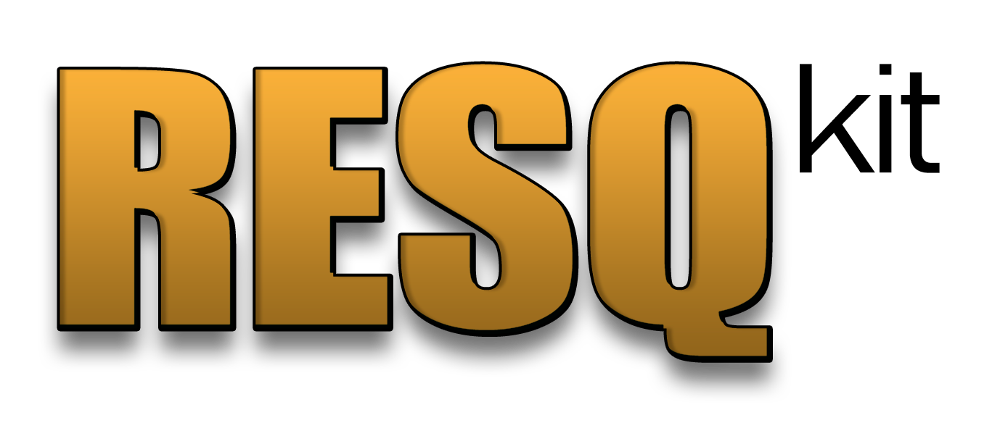

<div align="center">
  

# RESQ kit — погрузитесь в любой Quake 3 QVM. Анализируйте, декомпилируйте, пересобирайте.


</div>
> Перевод [README.md](README.md); при расхождениях приоритет у английского оригинала.

**R**estore **E**verything from **S**tale **Q**VM. (Восстановить всё из залежавшегося QVM)

Универсальный тулчейн для модулей id Tech 3: любой `.qvm` (`qagame` / `cgame` / `ui`) → identity C89 → (опционально) круговая пересборка через q3lcc в играбельный QVM.

RESQ — не швейцарский нож. Он ускоряет работу, но не превращает `.qvm` в готовый проект автоматически: чтение дампов, именование функций и разбор поведения остаются за аналитиком.

| | |
|--|--|
| Постоянные инструкции для агента | [`AGENT.ru.md`](AGENT.ru.md) |
| Как вести проект | [`PLAYBOOK.ru.md`](PLAYBOOK.ru.md) |
| Термины | [`GLOSSARY.ru.md`](GLOSSARY.ru.md) |
| Каталог probe-утилит | [`docs-ru/TOOLS.ru.md`](docs-ru/TOOLS.ru.md) |
| BSS-xref кваров | [`docs-ru/CVAR_XREF.ru.md`](docs-ru/CVAR_XREF.ru.md) |
| Emit → q3lcc → q3asm | [`docs-ru/TOOLCHAIN.ru.md`](docs-ru/TOOLCHAIN.ru.md) |
| Документация на английском | [`README.md`](README.md) |

## Структура

```
resq-kit/
  toolchain/qvm/       Rust crate (probe_emit, disasm, seqdiff, …)
  toolchain/gui/       resq-gui: egui-анализатор (список функций, disasm + C, строки/traps, переименования -> .map)
  tools/win32-qvm/     q3lcc / q3asm (Windows)
  tools/dump.py        strings ±4, identity insn/xref, cvar taint
  tools/qvmbits.py     IEEE i32 ↔ float (and Q3 TFL / CONTENTS)
  tools/scripts/       table / identity helpers (addresses on CLI)
  scripts/             emit_qvm.ps1, build_qvm.ps1
  work/                drop input QVMs here
```

## Быстрый старт

```powershell
cd toolchain\qvm
cargo build --release --bin probe_emit --bin probe_dump_all --bin probe_sigs `
  --bin probe_align --bin probe_disasm --bin probe_findfn --bin probe_findconst `
  --bin probe_check --bin probe_seqdiff --bin probe_uidiff --bin probe_cgamediff

cd ..\..
.\scripts\emit_qvm.ps1 -Qvm work\qagame.qvm -OutDir work\qagame
.\scripts\build_qvm.ps1 -SrcDir work\qagame -Stem qagame
```

На Linux тот же поток: `pwsh ./scripts/emit_qvm.ps1 …` плюс `./scripts/build_qvm.sh work/qagame qagame` (нужны свои `q3lcc`/`q3asm` в `PATH`).

`probe_emit` **по умолчанию без типов** (без оверлея `types.rs`; файл поставляется пустым шаблоном). Передавайте `--typed`, только если заполнили шаблон ключом, который можете доказать.

```powershell
python tools\dump.py --qvm work\qagame.qvm hdr
python tools\dump.py --qvm work\qagame.qvm find "Clan Arena"
python tools\dump.py --qvm work\qagame.qvm --c work\qagame\qagame.c cvar cg_foo
```

Приёмка пересборки: `probe_check` на новом QVM; `probe_seqdiff orig.qvm rebuilt.qvm` (qagame), `probe_cgamediff` / `probe_uidiff` для остальных.

## GUI

```powershell
cd toolchain\gui
cargo run --release --              # или: cargo run --release -- ..\..\work\qagame.qvm
```

`resq-gui` мгновенно открывает любой `.qvm`: список функций с фильтром, disasm и
identity C рядом, вкладки строк/ловушек с переходом по кросс-ссылкам в один
клик, переименования функций сохраняются в q3asm-совместимый `.map` рядом с
файлом (все probe'ы и `emit_qvm.ps1` подхватывают их через `--names`).

## Требования

- Rust (`cargo`) — анализ, декомпиляция и пересборка кроссплатформенны
- Python 3
- PowerShell (PowerShell 7 / `pwsh` на Linux) для скриптов-обёрток
- Шаг пересборки (`q3lcc` + `q3asm`):
  - **Windows**: используйте комплектные бинарники из `tools/win32-qvm/`
  - **Linux**: соберите свои lcc-based `q3lcc` / `q3asm` из исходников любого id Tech 3 тулчейна, положите в `PATH`, затем вызывайте `scripts/build_qvm.sh`

## Не упаковывать в zip

`toolchain/qvm/target/`, движки, pk3, identity-дампы конкретного мода.

## Лицензия

Набор (Rust-крейт, Python-утилиты, скрипты, доки) — [MIT](LICENSE).

Сторонние компоненты: бинарники в `tools/win32-qvm/` (`q3lcc`, `q3cpp`, `q3rcc`, `q3asm`, `7za`) — перераспространяемые сборки сторонних тулчейнов (линия id Tech 3 QVM-компилятора / lcc и 7-Zip). Они сохраняют свои исходные лицензии; MIT-грант этого репозитория на них не распространяется.
